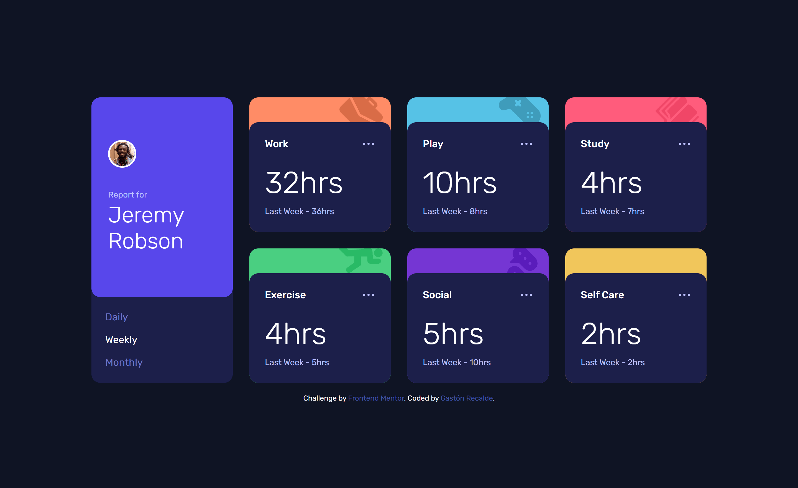

# Frontend Mentor - Time tracking dashboard solution

This is a solution to the [Time tracking dashboard challenge on Frontend Mentor](https://www.frontendmentor.io/challenges/time-tracking-dashboard-UIQ7167Jw). Frontend Mentor challenges help you improve your coding skills by building realistic projects. 

## Table of contents

- [Overview](#overview)
  - [Screenshot](#screenshot)
  - [Links](#links)
- [My process](#my-process)
  - [Built with](#built-with)
- [Author](#author)

## Overview

### Screenshot

### Links

- Live Site URL: (https://guileless-chimera-3aa3a1.netlify.app)

## My process

### Built with

- Semantic HTML5 markup
- CSS custom properties
- Flexbox
- CSS Grid
- Mobile-first workflow

## Author

- Website - [Gastón Recalde](https://gaston-recalde-portafolio.netlify.app)
- Frontend Mentor - [@Gaston-Recalde](https://www.frontendmentor.io/profile/Gaston-Recalde)
- Twitter - [@OsoRecalde](https://twitter.com/OsoRecalde)